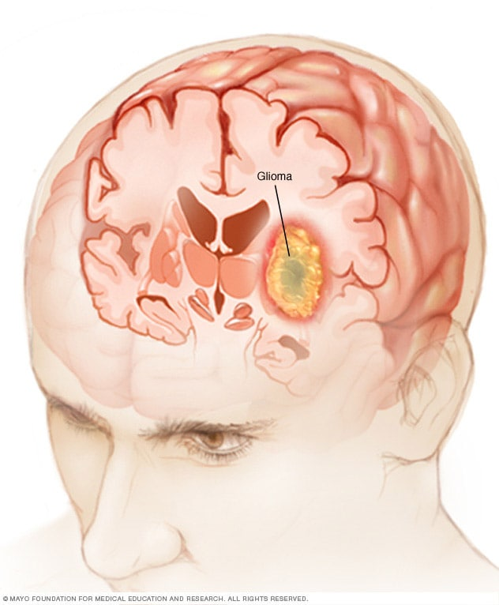
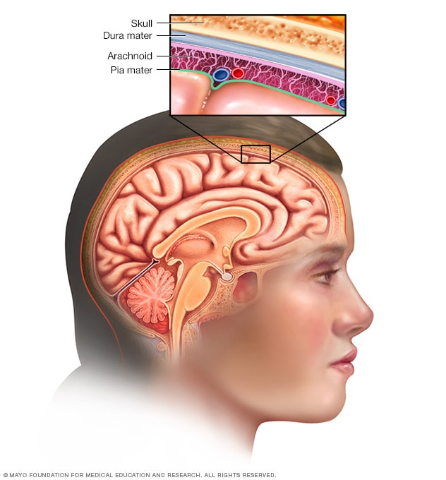
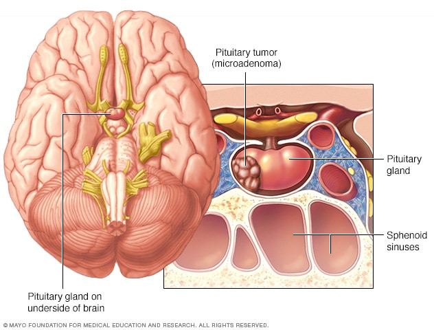
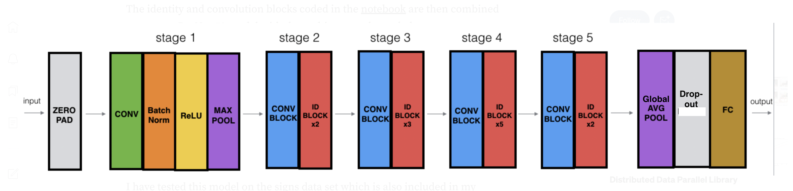

## Brain Tumor Classifier

### Background
A brain tumor is defined as a *mass or growth of abnormal cells in your brain*. Tumors can have many symptoms based on their size,location and growth rate, a few of the more common symptoms are:

* Headaches
* Nausea and Vomitting
* Difficulty with vision, balance, speech, and hearing
* Fatigue and Brain-fog

Brain tumors come in all different forms and there are many classifications of these tumors. However for this project I wanted to focus on tumors that are more common and have the potential to cause high damage. Based on some research I narrowed it down to the following three types of brain tumors:

* ***Gliomas***: These tumors begin in the brain or spinal cord and include astrocytomas, ependymomas, glioblastomas, oligoastrocytomas and oligodendrogliomas. Meningiomas. A meningioma is a tumor that arises from the membranes that surround your brain and spinal cord (meninges). Gliomas are the most prevalent type of adult brain tumor, accounting for *78 percent of malignant brain tumors*

* ***Meningiomas***: A meningioma is a tumor that arises from the membranes that surround your brain and spinal cord (meninges). Most meningiomas are noncancerous. Meningioma is most frequently found in older adults and is 2-3 times more common in women than in men, but when men are diagnosed with meningioma, they tend to have a more aggressive form of the disease.

* ***Pituitary adenomas***: These are tumors that develop in the pituitary gland at the base of the brain. These tumors can affect the pituitary hormones with effects throughout the body. Most pituitary tumors are not cancerous (benign), but they can have a significant impact on vision, particularly peripheral vision.

|              Gliomas             |         Meningiomas                 |        Pituitary adenomas          | 
|----------------------------------|-------------------------------------|------------------------------------|
| |||

 
 
 

### CNN Architecture

The Convolutional Neural Net (CNN) I used for this project was ResNet-50V2. The key differentiator between ResNet and other deep CNN's is that   Resnet's use skip connections to minimize vanishing gradients in back propogation. 

This image shows a single residual block, which uses a skip connection.

The ResNet-50 model consists of 5 stages each with a convolution and Identity block, followed by some final layers to get a 4 dimensional vector as output. The network has 23,527,556 trainable parameters in total.

The end of the network has a single ***GlobalAveragePooling2D*** layer, this takes the (8, 8, 2048) dimension output of the 5th stage and turns it into a single vector of size 2048 by taking the average of each channel. The image below depicts this process. 

Next I included a ***Dropout()*** layer with a 50% dropout rate for each node, this was put in place to prevent overfitting of the model. The photo below shows a Dropout layer.

Finally, the output layer was a regular ***Dense()** (fully connected) layer which was 4 dimensional. This was to represent the 4 possible outcomes which are shown in the table below:

|   No Tumor         |              Gliomas             |         Meningiomas                 |        Pituitary adenomas          | 
|--------------------|----------------------------------|-------------------------------------|------------------------------------|
$$\begin{bmatrix} 1  \\ 0 \\ 0 \\ 0 \end{bmatrix}$$ | $$\begin{bmatrix} 0  \\ 1 \\ 0 \\ 0 \end{bmatrix}$$| $$\begin{bmatrix} 0  \\ 0 \\ 1 \\ 0 \end{bmatrix}$$ | $$\begin{bmatrix} 0  \\ 0 \\ 0 \\ 1 \end{bmatrix}$$

### Results

After training the model for 10 epochs, the training accuracy was ***97.6%*** with a loss of ***0.0690***.

On the testing data, the model had an accuracy of ***96.4%***, with a loss of ***.109***

Overall the model performed fairly, however with more data it could be possible to improve the accuracy even more.

## References
https://www.kaggle.com/datasets/masoudnickparvar/brain-tumor-mri-dataset?resource=download

https://github.com/masoudnick/Brain-Tumor-MRI-Classification/blob/main/Preprocessing.py

https://docs.opencv.org/4.x/
                    
https://pyimagesearch.com/2016/04/11/finding-extreme-points-in-contours-with-opencv/

https://www.tensorflow.org/tutorials/images/transfer_learning

https://keras.io/api/applications/#usage-examples-for-image-classification-models

https://www.mayoclinic.org/diseases-conditions/pituitary-tumors/symptoms-causes/syc-20350548

https://www.mayoclinic.org/diseases-conditions/meningioma/symptoms-causes/syc-20355643

https://www.mayoclinic.org/diseases-conditions/glioma/symptoms-causes/syc-20350251

https://cv-tricks.com/keras/understand-implement-resnets/